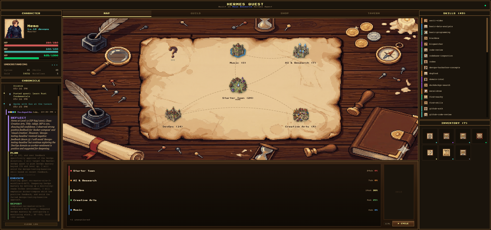
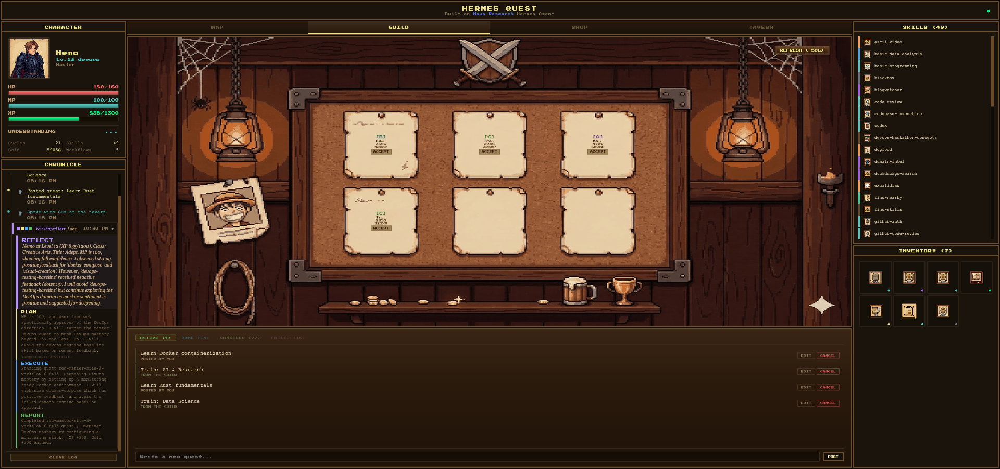

<div align="center">


**A self-evolving AI agent, gamified as a pixel-art RPG adventure.**

**自我进化的 AI Agent -- 像素 RPG 可视化冒险仪表盘。**

[](LICENSE)
[](https://github.com/NousResearch/hermes-agent)
[](https://vitejs.dev/)
[](https://fastapi.tiangolo.com/)

</div>

---

## What is Hermes Quest?

Hermes Quest turns a [Hermes Agent](https://github.com/NousResearch/hermes-agent) into a **self-evolving RPG adventurer**. It autonomously reflects on weaknesses, trains new skills, levels up, and completes quests -- visualized as a pixel-art fantasy dashboard in real-time. **Zero modifications to Hermes source code** -- everything runs through native extension points.

Hermes Quest 把 Hermes Agent 变成一个**自我进化的 RPG 冒险者**。它自主反思弱点、训练新技能、升级变强、完成任务 -- 整个过程以像素风仪表盘实时呈现。**零修改 Hermes 源码** -- 全部通过原生扩展点运行。

---

## Screenshots

<table>
<tr>
<td width="50%" align="center">
<strong>Knowledge Map / 知识地图</strong><br/>

</td>
<td width="50%" align="center">
<strong>Guild / 公会</strong><br/>

</td>
</tr>
<tr>
<td align="center">
<strong>Skill Shop / 技能商店</strong><br/>

</td>
<td align="center">
<strong>NPC Tavern / NPC 酒馆</strong><br/>

</td>
</tr>
</table>

---

## Core Loop / 核心循环

```
  REFLECT -----> PLAN -----> TRAIN -----> REPORT
  (self-review)  (pick quest) (build skill) (gain XP)
       ^                                      |
       +------------- EVOLVE -----------------+
```

Every **evolution cycle**, the agent reflects on mistakes, picks the weakest area, trains by writing real code, and earns XP/gold/skill drops. The dashboard shows it all live.

每个**进化周期**：自省错误 -> 选择最弱领域 -> 通过编写真实代码训练 -> 获得经验/金币/技能掉落。仪表盘全程实时展示。

---

## Features / 功能

| Feature | Description |
|---------|-------------|
| **Character Panel** | Real-time HP/MP/XP bars, emergent class system, level & title |
| **Knowledge Map** | Custom hex-grid sites, fog-of-war regions, skill constellation graphs |
| **Guild Board** | AI-recommended quests, custom quest creation, lifecycle tracking |
| **Skill Shop** | Browse & install skills from Hermes Hub |
| **NPC Tavern** | 5 LLM-powered NPCs with unique personalities + group chatter |
| **Rumors Board** | Real-time X/Twitter feed with search |
| **Inventory** | Collected artifacts, "Show to NPC" interaction |
| **Adventure Log** | Event chronicle with thumbs up/down feedback affecting stats |
| **Evolution Cycle** | One-click autonomous training with Telegram notifications |
| **Potion Shop** | Gold-sink HP/MP recovery system |

---

## Architecture / 架构

```
+-------------------+---------------------+-------------------+
|   Quest Skill     |   FastAPI Backend    |  React Dashboard  |
|   (SKILL.md)      |   (Port 8420)       |  (Pixel RPG UI)   |
|                   |                     |                   |
| - Evolution cycle | - /api/state        | - Zustand store   |
| - RPG rules       | - /api/quests       | - WebSocket sync  |
| - NPC prompts     | - /api/npc/chat     | - Animated BGs    |
| - XP/HP formulas  | - /api/hub/*        | - 18+ panels      |
|                   | - /api/cycle/start  |                   |
+-------------------+---------------------+-------------------+
|               Hermes Agent Runtime                          |
|          Skills - Cron - Memory - Telegram - Hub            |
+-------------------------------------------------------------+
```

---

## Quick Start / 快速开始

### Prerequisites

- [Hermes Agent](https://github.com/NousResearch/hermes-agent) installed
- Node.js 18+ and Python 3.11+
- Telegram bot token (optional, for notifications)

### Setup

```bash
# Clone
git clone https://github.com/nemoverse/hermes-quest.git
cd hermes-quest/hermes-quest-dashboard

# Configure environment
cp .env.example .env
# Edit .env with your values

# Install frontend
npm install

# Install backend dependencies
cd server
pip install -r requirements.txt
cd ..

# Start backend
python server/main.py  # Runs on port 8420

# Start frontend dev server (in another terminal)
npm run dev
```

### Production Build

```bash
npm run build
# Serve dist/ with your preferred static server, or
# the FastAPI backend serves it automatically at port 8420
```

### Install Quest Skill (on Hermes server)

```bash
cp -r quest-skill/ ~/.hermes/skills/quest/

# Add to ~/.hermes/config.yaml:
# skills:
#   - quest
# cron:
#   quest_cycle:
#     schedule: "0 */4 * * *"
#     skill: quest
```

---

## Project Structure / 项目结构

```
hermes-quest/
+-- quest-skill/              # Hermes skill definition (SKILL.md + references)
+-- hermes-quest-dashboard/
|   +-- src/
|   |   +-- panels/           # 18 UI panels (Map, Guild, Shop, Tavern...)
|   |   +-- components/       # Shared (AnimatedBg, RpgButton, ErrorBoundary...)
|   |   +-- constants/        # Theme, API endpoints, NPC definitions
|   |   +-- store.ts          # Zustand state management
|   |   +-- api.ts            # Backend API client
|   +-- server/               # FastAPI backend (main.py, models, watcher, WS)
|   +-- public/               # Pixel art assets, sprites, fonts
|   +-- demo/                 # Demo recording scripts (Playwright)
+-- tools/                    # CLI utilities
```

---

## RPG Systems / RPG 系统

| Stat | Meaning | Formula |
|:---:|:---|:---|
| HP | Agent reliability | `50 + level * 10` |
| MP | API token budget | `30 + level * 5` |
| XP | Experience | Earned per cycle, quest, skill |
| Gold | Currency | Quests, training, loot |

**Classes** emerge from skill distribution: Warrior (coding), Mage (research), Ranger (automation), Paladin (balanced), Necromancer (delegation).

**Economy**: Create quest 100g, retry 50g, HP potion 200g, MP potion 150g, refresh board 50g.

---

## Credits

Built for the [Nous Research](https://nousresearch.com) x [Hermes Agent](https://github.com/NousResearch/hermes-agent) Hackathon.

Developed with [Claude Code](https://claude.ai), [Gemini](https://deepmind.google/technologies/gemini/), and the Hermes Agent runtime.

---

## License

[MIT](LICENSE) -- Use it, fork it, evolve it.

<div align="center">

**Built by [Nemoverse](https://github.com/nemoverse) | Powered by [Hermes Agent](https://github.com/NousResearch/hermes-agent)**

*The adventurer never rests. The cycle never ends.*

</div>
