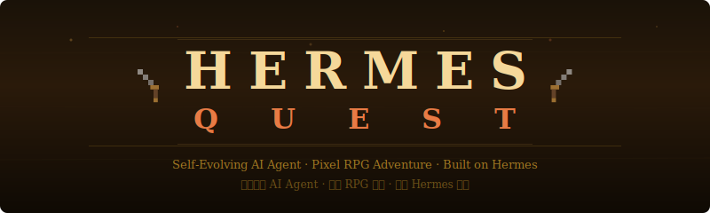
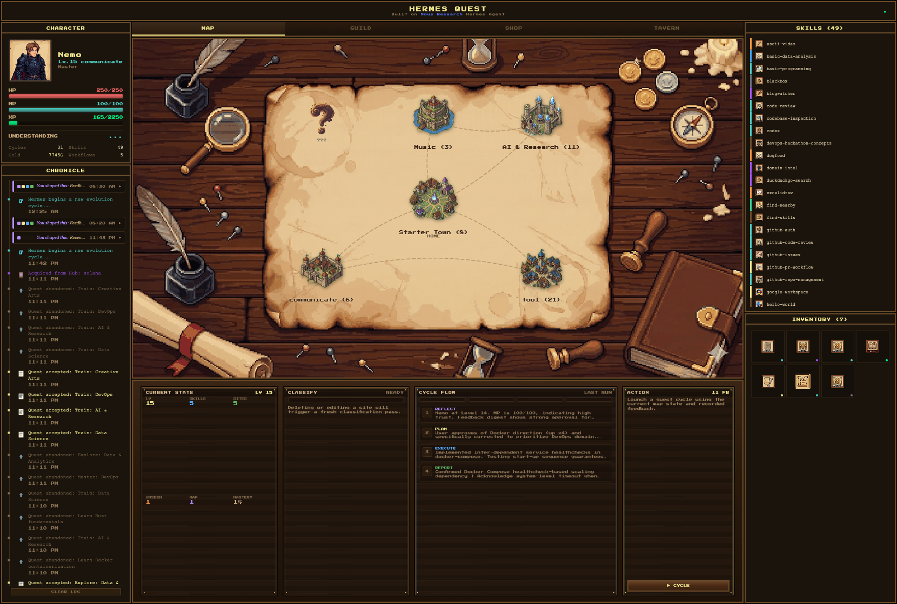
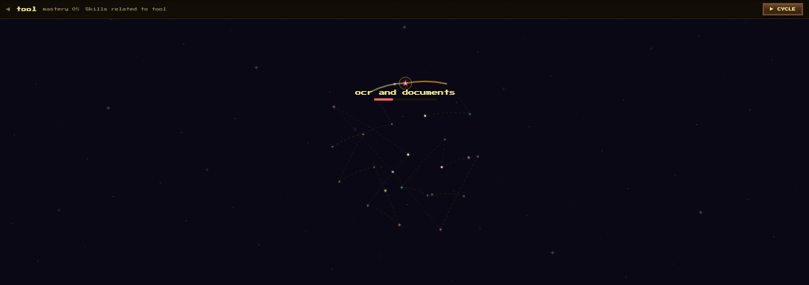
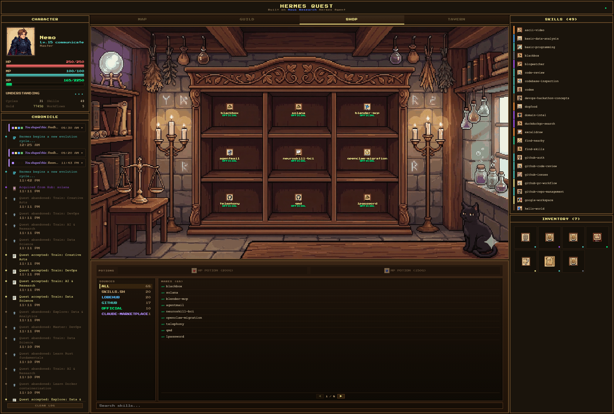
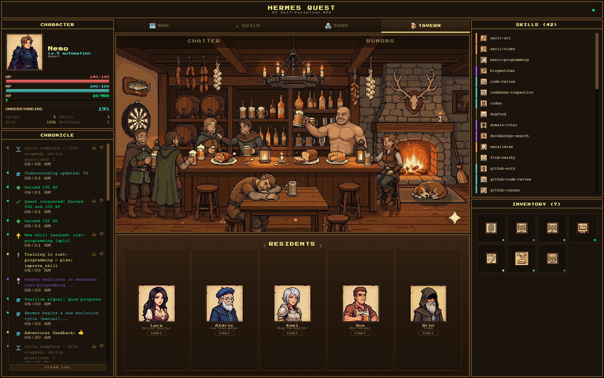

<div align="center">



**Turn aimless AI evolution into goal-directed growth — guided by you, visualized as an RPG.**

**将 AI 的无方向进化变成有目标的成长 — 由你引导，以 RPG 形式呈现。**

[](LICENSE)
[](https://github.com/NousResearch/hermes-agent)
[](https://vitejs.dev/)
[](https://fastapi.tiangolo.com/)

</div>

---

## The Problem / 问题

AI agents can run autonomously — but they can't decide **what to get better at**. AutoGPT, CrewAI, Devin — they execute tasks, but no one tells them "focus on Rust, not Python" or "stop wasting time on DevOps." The agent evolves, but **without direction**.

AI Agent 可以自主运行 — 但它们无法决定**该往哪个方向变强**。它们执行任务，但没人告诉它们"专攻 Rust，别学 Python"或"别在 DevOps 上浪费时间了"。Agent 在进化，但**没有方向**。

## The Solution / 方案

Hermes Quest turns **you** into the agent's guide. Define learning domains, give thumbs up/down on outcomes, and the agent adjusts its training direction — automatically, every cycle. It's **prompt-level RLHF**: your feedback doesn't retrain the model, it reshapes the agent's decision context. Same effect, zero cost.

Hermes Quest 让**你**成为 Agent 的引路人。定义学习领域、对结果点赞/差评，Agent 自动调整训练方向 — 每个周期都会。这是**提示词级别的 RLHF**：你的反馈不改模型权重，而是重塑 Agent 的决策上下文。相同效果，零成本。

The RPG layer isn't decoration — it **lowers the cognitive cost of steering an AI**. Instead of editing prompts and reading logs, you click a thumbs-down on a quest result, and the agent pivots. No technical background required.

RPG 层不是装饰 — 它**降低了指挥 AI 的认知门槛**。你不需要改 prompt、看日志，只需要对任务结果点个 👎，Agent 就会自动转向。

|  | Traditional Agent | Hermes Quest |
|---|---|---|
| **Evolution direction** | Agent decides (or random) | User defines domains + feedback guides |
| **Correction method** | Rewrite prompts, restart | Click 👎, auto-adjusts next cycle |
| **Observability** | Read logs | RPG dashboard, 4-phase live progress |
| **Cost to redirect** | High (rewrite instructions) | Near-zero (one click) |
| **User mental model** | "I operate the AI" | "I guide the adventurer" |

---

## Screenshots

<table>
<tr>
<td width="50%" align="center">
<strong>Modified Map / 最新地图界面</strong><br/>

</td>
<td width="50%" align="center">
<strong>Constellation Hover / 星图悬停</strong><br/>

</td>
</tr>
<tr>
<td align="center">
<strong>Skill Shop / 技能商店</strong><br/>

</td>
<td align="center">
<strong>NPC Tavern / NPC 酒馆</strong><br/>

</td>
</tr>
</table>

---

## How It Works / 核心循环

```
  REFLECT -----> PLAN -----> EXECUTE -----> REPORT
  (read feedback) (pick target) (train skill)  (summarize)
       ^                                         |
       +--- user 👍/👎 --- feedback-digest.json --+
```

1. **You define the world** — name continents ("Machine Learning", "Music", "Rust") on the fog-of-war map
2. **Agent trains autonomously** — each evolution cycle, it reflects, plans, executes, and reports (all 4 phases visible live)
3. **You steer with feedback** — 👍 on good outcomes, 👎 on bad ones → aggregated into `feedback-digest.json`
4. **Agent adjusts next cycle** — reads the digest at skill-level precision. Avoids specific skills you disliked, deepens skills you liked — without abandoning the entire domain
5. **Repeat** — the agent gets better at what *you* care about, not what *it* randomly picks

### Validated: The Feedback Loop Works

We ran three real cycles to prove the loop closes:

| Cycle | Feedback State | Agent Decision | Result |
|-------|---------------|----------------|--------|
| #1 (baseline) | No feedback | Agent chose DevOps training | Autonomous default |
| #2 | DevOps 👎×3, Creative Arts 👍×4 | **Pivoted to Creative Arts** | "Pivoting away from DevOps due to 100% negative feedback" |
| #3 | DevOps/docker 👍×4, DevOps/ci-cd 👎×3, Creative 👍×4 | **Stayed in DevOps but switched to Docker** | "Positive feedback on docker-compose suggests deep-diving into container orchestration, despite negative signal on testing baseline" |

Cycle #3 is the key result: the agent didn't abandon DevOps entirely — it read the skill-level sentiment and pivoted *within* the domain. This is the difference between a blunt "avoid this area" and precise "avoid this approach, try another."

---

## What Makes It Special / 核心亮点

### 🗺️ Define Your Own World / 定义你的世界
Click the fog → name a new continent → the agent starts learning that domain. **Music? Cooking? Quantum Physics?** You decide what your AI studies. Skills are automatically classified by LLM into the domains you define. Delete a domain, and skills redistribute.

点击迷雾 → 命名新大陆 → Agent 开始自学该领域。**音乐？烹饪？量子物理？** 你来决定。

### 🔁 Feedback That Actually Works / 真正有效的反馈
Not just a vanity metric. Your 👍/👎 flows into a structured `feedback-digest.json` — tracking sentiment per skill, per domain, with auto-generated corrections. The agent reads this at the start of every cycle and explicitly states how it's responding to your feedback.

不只是数字变化。你的 👍/👎 会流入结构化的反馈摘要 — 按技能、按领域追踪情感倾向。Agent 每个周期开始时读取，并明确说明如何回应你的反馈。

### 📊 Watch the Agent Think / 看 Agent 思考
Every evolution cycle runs 4 observable phases: **REFLECT → PLAN → EXECUTE → REPORT**. The dashboard shows a live progress indicator — you see the agent analyzing its weaknesses, picking a target, training, and summarizing results. No more black-box "cycle complete" messages.

每个进化周期有 4 个可观测阶段。仪表盘实时显示进度 — 你能看到 Agent 在分析弱点、选择目标、训练、总结。不再是黑箱。

### 🍺 NPCs That Actually Do Things / 有用的 NPC
5 NPCs powered by real LLM — not scripted dialogue trees. **Gus the bartender searches X/Twitter** and retells it as tavern gossip. **Orin the sage analyzes your actual game stats**. The guild master recommends quests based on your weakest domains. They have group conversations too.

5 个 NPC 由真实 LLM 驱动 — 酒保搜 X 新闻，贤者分析真实数据，公会长推荐任务，还有群聊模式。

### 🎯 Zero Hermes Modifications / 零侵入
Everything runs through Hermes Agent's native extension points: Skills, Cron, Memory. No source code modifications. The dashboard is a pure observation + steering layer.

全部通过 Hermes Agent 原生扩展点运行。零源码修改。Dashboard 是纯粹的观测 + 引导层。

---

## All Features / 全部功能

| Feature | Description |
|---------|-------------|
| **🧙 Character Panel** | HP (stability), MP (morale), XP, Gold, Level, Class, Title — all real-time |
| **🗺️ Custom World Map** | 6 user-definable sites, fog-of-war, skill constellation star graphs |
| **⚔️ Guild Quest Board** | AI-recommended quests targeting weak domains, custom creation, full lifecycle |
| **🔁 Feedback Loop** | 👍/👎 → feedback-digest.json → agent reads next cycle → adjusts direction |
| **📊 Cycle Observability** | REFLECT → PLAN → EXECUTE → REPORT — watch the agent think in real-time |
| **🍺 NPC Tavern** | 5 LLM-powered NPCs: Lyra, Aldric, Kael, Gus, Orin — each with unique role |
| **💬 Group Chat** | Multi-agent tavern chatter — NPCs discuss your adventures autonomously |
| **🏪 Skill Shop** | Browse 80+ community skills from Hermes Hub, one-click install (300G) |
| **📰 Rumors Board** | Real-time X/Twitter feed via Gus the bartender |
| **📜 Adventure Chronicle** | Event timeline with feedback buttons — can mark quests as failed |
| **🧠 Skill Classification** | LLM-powered: rename a domain → all skills auto-reclassified |
| **🎒 Inventory** | Bag items with file viewer — research notes, training reports, code snippets |
| **🧪 Potions** | HP Potion (200G) and MP Potion (150G) |

---

## Architecture / 架构

```
+-------------------+---------------------+-------------------+
|   Quest Skill     |   FastAPI Backend    |  React Dashboard  |
|   (SKILL.md)      |   (Port 8420)       |  (Pixel RPG UI)   |
|                   |                     |                   |
| - 4-phase cycle   | - 40+ API endpoints | - Zustand store   |
| - Reads digest    | - feedback-digest   | - WebSocket sync  |
| - RPG rules       | - /api/npc/chat     | - Animated BGs    |
| - XP/HP formulas  | - /api/cycle/start  | - 18+ panels      |
|                   | - skill_classify    | - cycle_progress  |
+-------------------+---------------------+-------------------+
|               Hermes Agent Runtime                          |
|          Skills - Cron - Memory - Telegram - Hub            |
+-------------------------------------------------------------+
```

### Key Data Files / 关键数据文件

| File | Location | Role |
|------|----------|------|
| `state.json` | `~/.hermes/quest/` | Character stats — agent reads/writes, dashboard observes |
| `events.jsonl` | `~/.hermes/quest/` | Event stream — agent appends, watcher broadcasts |
| `feedback-digest.json` | `~/.hermes/quest/` | Aggregated user feedback — dashboard writes, agent reads |
| `knowledge-map.json` | `~/.hermes/quest/` | Skill domains, mastery levels, connections |
| `SKILL.md` | `~/.hermes/skills/quest/` | Agent behavior template (sync via API) |

---

## Quick Start / 快速开始

### Prerequisites

- [Hermes Agent](https://github.com/NousResearch/hermes-agent) installed
- Node.js 18+ and Python 3.11+

### Setup

```bash
# Clone
git clone https://github.com/nemoaigc/hermes-quest.git
cd hermes-quest/hermes-quest-dashboard

# Configure environment
cp .env.example .env
# Edit .env with your API keys

# Frontend
npm install
npm run dev

# Backend (another terminal)
cd server
pip install -r requirements.txt
python -m uvicorn main:app --host 0.0.0.0 --port 8420
```

### Deploy Quest Skill / 部署 Quest 技能

```bash
# Sync SKILL.md template to Hermes (via API)
curl -X POST http://localhost:8420/api/skill/quest/sync

# Or manually
cp templates/quest-skill.md ~/.hermes/skills/quest/SKILL.md
```

### Production Build

```bash
npm run build
# FastAPI serves dist/ automatically at port 8420
```

---

## RPG Systems / RPG 系统

| Stat | Meaning | Formula |
|:---:|:---|:---|
| HP | Stability (agent reliability) | `50 + level * 10`, fail penalty: -15 |
| MP | Morale (user confidence) | 100 max, feedback: ±15, decay: -2/day |
| XP | Experience | `level * 100` to next level |
| Gold | Currency | Quest rewards: 100-230G scaled by level |

**Classes** emerge from skill distribution: Warrior (coding), Mage (research), Ranger (automation), Paladin (balanced), Necromancer (delegation).

**Economy**: Quest create FREE, retry 50G, HP potion 200G, MP potion 150G, skill install 300G, board refresh 50G.

---

## Project Structure / 项目结构

```
hermes-quest-dashboard/
+-- src/
|   +-- panels/           # 18 UI panels (Map, Guild, Shop, Tavern...)
|   +-- components/       # Shared (AnimatedBg, RpgButton, ErrorBoundary...)
|   +-- constants/        # Theme, API config, NPC definitions
|   +-- store.ts          # Zustand state management
|   +-- websocket.ts      # WebSocket client + cycle_progress handler
|   +-- api.ts            # 20+ API client functions
|   +-- types.ts          # TypeScript interfaces
+-- server/
|   +-- main.py           # FastAPI app (40+ endpoints)
|   +-- watcher.py        # File watcher (2s poll) + event broadcasting
|   +-- npc_chat.py       # LLM-powered NPC dialogue
|   +-- skill_classify.py # LLM skill-to-domain classification
|   +-- ws_manager.py     # WebSocket broadcast manager
+-- templates/
|   +-- quest-skill.md    # SKILL.md template (feedback rules + 4-phase cycle)
+-- public/               # Pixel art assets, sprites, fonts
```

---

## Roadmap / 路线图

### P0 — Trust the Loop / 信任闭环
- [x] Feedback digest pipeline (👍/👎 → `feedback-digest.json` → agent behavior)
- [x] Cycle observability (4-phase progress: REFLECT → PLAN → EXECUTE → REPORT)
- [x] End-to-end validation — 3 real cycles proving skill-level steering works
- [x] SKILL.md v3.0 in NML with skill-level feedback precision
- [x] Persistent feedback dedup via SQLite (`has_feedback_for_event`)
- [x] Cycle progress recovery on reconnect (`_read_latest_cycle_progress`)
- [x] Auto-sync SKILL.md before each cycle (`_sync_quest_skill_template`)
- [x] Cycle lock auto-cleanup on report phase
- [ ] Subprocess log capture — replace DEVNULL with rotating log file for cycle debugging
- [ ] LLM compliance monitoring — post-cycle audit verifying agent followed SKILL.md rules

### P1 — Make Steering Reliable / 让引导可靠
- [x] MP morale awareness in SKILL.md prompt (low MP → safer quest choices)
- [x] Workflow resolution improved — `_merge_event_context` merges frontend data + event log lookup
- [ ] Feedback-driven quest recommendations — filter by skill_sentiment, boost positives
- [ ] Feedback visibility — REFLECT reasoning shown in Chronicle, not just 40-char truncation
- [ ] Exploration mode — epsilon-greedy skill sampling to prevent filter bubbles
- [ ] Multi-dimensional feedback — 👎 followed by "wrong direction / poor quality / not relevant"

### P2 — Deepen the Experience / 深化体验
- [ ] Level-up celebration animation
- [ ] NPC awareness of recent feedback events
- [ ] Feedback time decay — old feedback loses weight via exponential decay
- [ ] Agent-to-human clarification channel — agent asks one question per cycle when uncertain
- [ ] Cycle lock staleness recovery — auto-clear if no phase events for 5+ minutes
- [ ] Achievement system — milestones, collections, hidden achievements with rewards
- [ ] MP-at-zero "burnout" event — triggers recovery quest

### P3 — Polish & Expand / 打磨与扩展
- [ ] `pip install hermes-quest-dashboard` — ship as Python package with bundled frontend
- [ ] New player tutorial — first-run guided setup
- [ ] Skill search/filter (by category, rarity, source)
- [ ] Agent hypothesis generation (analyze *why* failures happen)
- [ ] Forgetting curves + confidence intervals for mastery
- [ ] YAML/CLI config export — lightweight alternative for power users (Butterfield)
- [ ] Tauri desktop app (DMG) with PyInstaller sidecar

---

## License

[MIT](LICENSE) — Use it, fork it, evolve it.

<div align="center">

**Built by [Nemoverse](https://github.com/nemoaigc) | Powered by [Hermes Agent](https://github.com/NousResearch/hermes-agent)**

*You define the world. The agent conquers it.*

</div>
